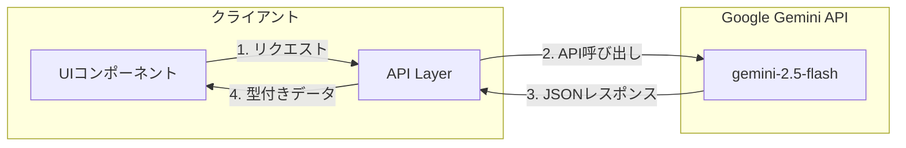
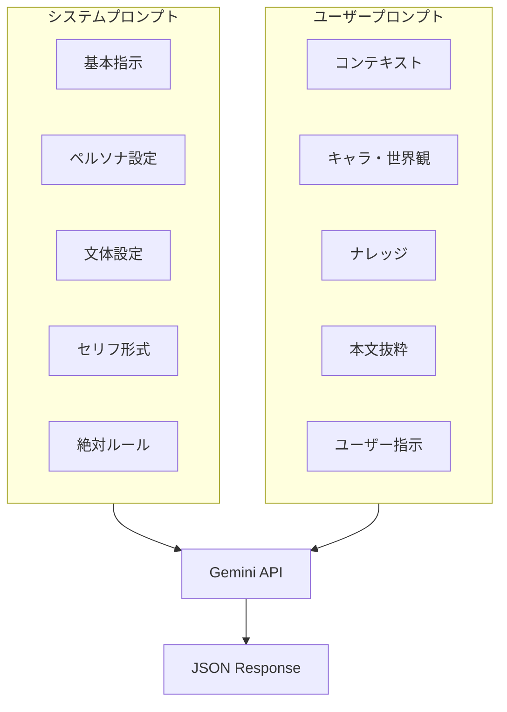
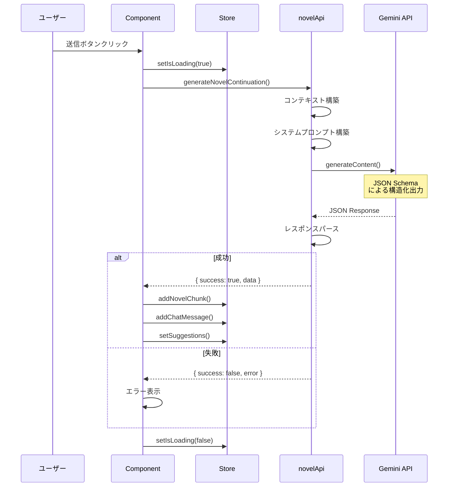

# AI API仕様

このページでは、Google Gemini APIとの連携について説明します。

## API概要

小説らいたーは、Google Generative AI (Gemini) を使用してAI機能を実装しています。



## APIファイル構成

| ファイル | 用途 |
|---------|------|
| `novelApi.ts` | 小説本文の生成 |
| `characterApi.ts` | キャラクター設定の生成 |
| `worldApi.ts` | 世界観設定の生成 |
| `utilityApi.ts` | 固有名詞生成など |
| `analysisApi.ts` | テキスト解析 |
| `imageApi.ts` | 画像生成 |
| `apiUtils.ts` | 共通ユーティリティ |

## 共通ユーティリティ (apiUtils.ts)

### getAiClient

Gemini クライアントを取得します。

```typescript
export const getAiClient = () => {
    return new GoogleGenAI({
        apiKey: import.meta.env.VITE_GEMINI_API_KEY
    });
};
```

### withTimeout

タイムアウト付きでPromiseを実行します。

```typescript
export const withTimeout = <T>(
    promise: Promise<T>,
    timeoutMs: number
): Promise<T> => {
    return Promise.race([
        promise,
        new Promise<T>((_, reject) =>
            setTimeout(() => reject(new Error('Timeout')), timeoutMs)
        )
    ]);
};

// 使用例
const response = await withTimeout(
    client.models.generateContent({...}),
    API_TIMEOUT
);
```

### handleError

エラーを統一的に処理します。

```typescript
export const handleError = (error: unknown, context: string) => {
    console.error(`Error in ${context}:`, error);
    return {
        success: false as const,
        error: error instanceof Error ? error.message : 'Unknown error'
    };
};
```

## 小説生成API (novelApi.ts)

### generateNovelContinuation

小説の続きを生成するメインAPI。

```typescript
interface GenerateParams {
    prompt: string;
    generationMode: 'write' | 'consult';
    aiSettings: AiSettings;
    knowledgeBase: KnowledgeItem[];
    settings: SettingItem[];
    characterRelations: Relation[];
    novelContent: NovelChunk[];
    plotBoard: PlotItem[];
    userName?: string;
    userMode: UserMode;
}

interface GenerateResult {
    success: true;
    data: {
        replyText: string;
        newChunk: NovelChunk | null;
        continuations: Array<{
            id: string;
            title: string;
            text: string;
        }> | null;
        suggestions: {
            knowledge: string[];
            plot: PlotItem[];
        };
        extractCharacterRequest: { name: string } | null;
    };
} | {
    success: false;
    error: string;
}
```

### システムプロンプト構成



### レスポンススキーマ

執筆モード（単一生成）：

```typescript
const responseSchema = {
    type: Type.OBJECT,
    properties: {
        replyText: {
            type: Type.STRING,
            description: 'AIからのコメント'
        },
        newChunk: {
            type: Type.STRING,
            description: '生成された小説本文'
        },
        suggestions: {
            type: Type.OBJECT,
            properties: {
                knowledge: {
                    type: Type.ARRAY,
                    items: { type: Type.STRING }
                },
                plot: {
                    type: Type.ARRAY,
                    items: {
                        type: Type.OBJECT,
                        properties: {
                            title: { type: Type.STRING },
                            summary: { type: Type.STRING },
                            type: { type: Type.STRING }
                        }
                    }
                }
            }
        }
    },
    required: ['replyText', 'newChunk', 'suggestions']
};
```

## キャラクターAPI (characterApi.ts)

### generateCharacterDetails

キャラクター設定をAIで生成。

```typescript
interface CharacterGenerateParams {
    prompt: string;
    existingSettings: SettingItem[];
    novelContext: string;
}

// レスポンス例
{
    name: "アリシア",
    age: "17",
    gender: "女性",
    personality: "明るく社交的だが...",
    speechPattern: "〜だよ、〜かな？",
    themeColor: "#FF6B9D",
    // ...
}
```

### キャラクター抽出

本文からキャラクターを自動抽出。

```typescript
interface ExtractedCharacterDetail {
    name: string;
    age: number | null;
    gender: string | null;
    personality: string;
    speechStyle: string;
    role: string;
    confidence: "high" | "medium" | "low";
    suggestedColor?: string;
    summary: string;
    detailDescription: string;
    memo: string;
    dialogueSamples: string[];
}
```

## 世界観API (worldApi.ts)

### generateWorldDetails

世界観設定をAIで生成。

```typescript
interface WorldGenerateParams {
    prompt: string;
    templateType: string;
    existingWorlds: SettingItem[];
}

// テンプレートタイプ
type WorldTemplate =
    | '場所'
    | '組織'
    | '魔法'
    | '歴史的事件'
    | 'アイテム'
    | '種族';
```

## ユーティリティAPI (utilityApi.ts)

### generateNames

固有名詞を生成。

```typescript
interface NameGenerateParams {
    category: string;  // 'ファンタジー風', '現代日本風', etc.
    keywords: string;
    count?: number;    // デフォルト10
}

// レスポンス
{
    names: string[]  // 生成された名前の配列
}
```

## テキスト解析API (analysisApi.ts)

### analyzeText

テキストを解析してキャラクター・用語を抽出。

```typescript
interface AnalysisResult {
    characters: {
        match: string[];      // 既存と完全一致
        similar: Array<{      // 類似
            text: string;
            target: string;
        }>;
        new: string[];        // 新規
        extractedDetails: ExtractedCharacterDetail[];
    };
    worldContext: {
        worldKeywords: string[];
        genre: string;
        tone: string;
    };
    worldTerms: {
        match: string[];
        similar: Array<{ text: string; target: string }>;
        new: Array<{ name: string; description: string }>;
    };
    dialogues: Array<{
        text: string;
        possibleSpeaker: string | null;
    }>;
    notes: string[];
}
```

## API設定オプション

### temperature（創作性）

```typescript
const temperature =
    aiSettings.creativity === '大胆' ? 1.0 :
    aiSettings.creativity === '控えめ' ? 0.3 :
    0.7;  // 標準
```

### タイムアウト設定

```typescript
export const API_TIMEOUT = 30000;        // 30秒
export const WRITE_API_TIMEOUT = 60000;  // 60秒（執筆モード）
```

## エラーハンドリング

### 統一されたエラー形式

```typescript
type ApiResult<T> =
    | { success: true; data: T }
    | { success: false; error: string };

// 使用例
const result = await generateNovelContinuation(params);
if (result.success) {
    // result.data を使用
} else {
    // result.error を表示
}
```

### よくあるエラー

| エラー | 原因 | 対処 |
|--------|------|------|
| Timeout | 生成に時間がかかりすぎ | 長さを短くする |
| Rate Limit | API制限 | しばらく待つ |
| Invalid Response | JSONパースエラー | リトライ |
| Network Error | 接続問題 | 接続確認 |

## シーケンス図：完全な生成フロー


