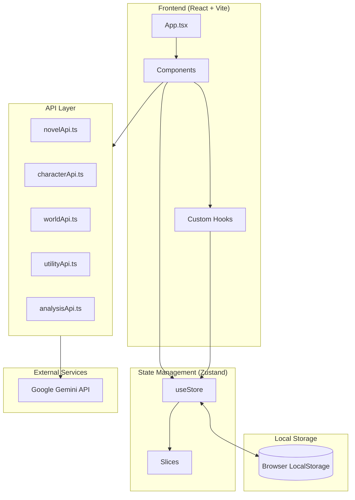
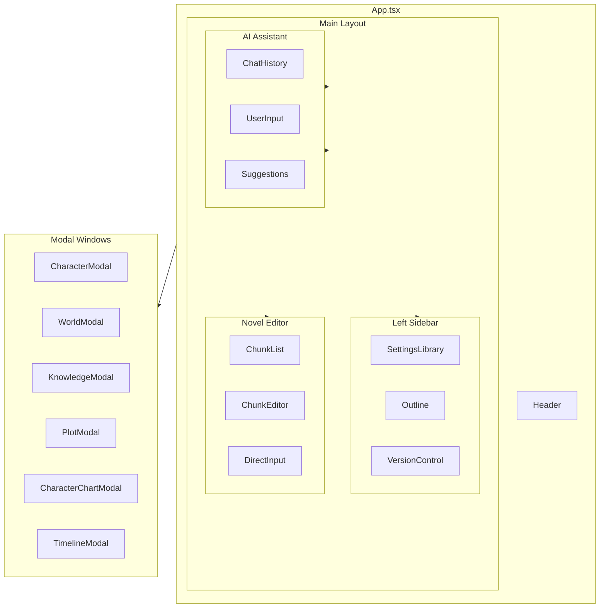
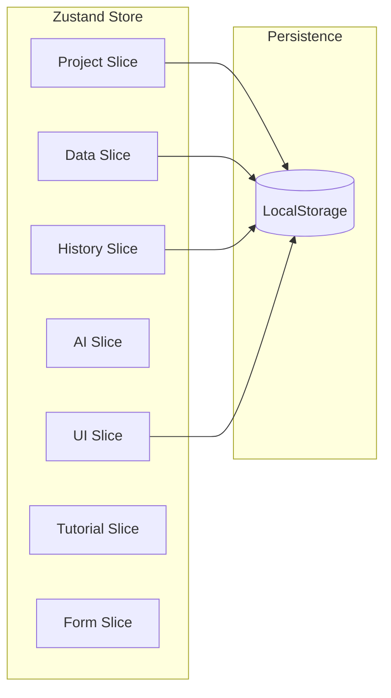
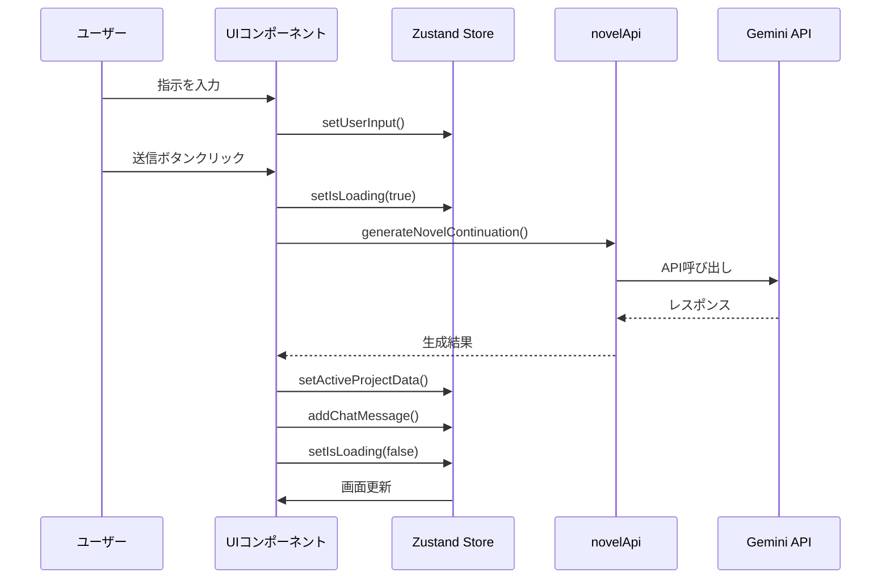
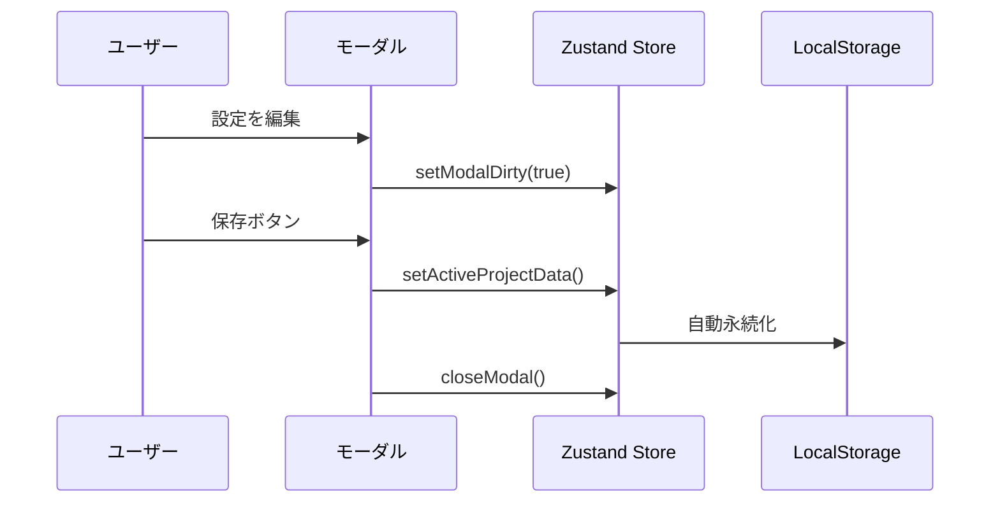

# システムアーキテクチャ

このページでは、小説らいたーのシステム全体のアーキテクチャを説明します。

## 技術スタック

| レイヤー | 技術 |
|---------|------|
| Frontend | React + TypeScript |
| Build | Vite |
| State | Zustand |
| Styling | CSS (index.css) |
| AI API | Google Generative AI (Gemini) |
| Storage | LocalStorage |

## 全体アーキテクチャ



## コンポーネント構成



## 状態管理アーキテクチャ



## データフロー

### AI執筆フロー



### 設定保存フロー



## ディレクトリ構造

```
novel-writer/
├── App.tsx              # メインアプリケーション
├── App.mobile.tsx       # モバイル版
├── types.ts             # 型定義
├── constants.ts         # 定数
├── utils.ts             # ユーティリティ関数
├── index.css            # スタイル
│
├── store/               # 状態管理
│   ├── index.ts         # ストア本体
│   ├── projectSlice.ts  # プロジェクト管理
│   ├── uiSlice.ts       # UI状態
│   ├── dataSlice.ts     # データ操作
│   ├── aiSlice.ts       # AI関連
│   ├── historySlice.ts  # 履歴管理
│   ├── tutorialSlice.ts # チュートリアル
│   └── formSlice.ts     # フォーム状態
│
├── components/          # UIコンポーネント
│   ├── Header.tsx
│   ├── LeftSidebar/
│   ├── NovelEditor/
│   ├── AiAssistant/
│   └── modals/
│
├── hooks/               # カスタムフック
│   └── useLocalStorage.ts
│
├── novelApi.ts          # 小説生成API
├── characterApi.ts      # キャラクター生成API
├── worldApi.ts          # 世界観生成API
├── utilityApi.ts        # ユーティリティAPI
├── analysisApi.ts       # テキスト解析API
├── imageApi.ts          # 画像生成API
└── apiUtils.ts          # API共通処理
```

## 主要な設計方針

### 1. コンポーネント設計

- **Smart/Dumb パターン**: ロジックを持つコンテナと表示専用コンポーネントを分離
- **モーダル集約**: 全てのモーダルを `App.tsx` で管理し、`activeModal` で制御

### 2. 状態管理

- **Slice パターン**: 機能ごとに状態を分割して管理
- **永続化**: `zustand/middleware` の `persist` で自動保存
- **履歴管理**: Undo/Redo を独自のツリー構造で実装

### 3. API設計

- **構造化出力**: Gemini の JSON Schema を活用した型安全なレスポンス
- **エラーハンドリング**: 統一された `handleError` 関数
- **タイムアウト**: `withTimeout` ラッパーで制御

### 4. パフォーマンス

- **遅延読み込み**: モーダルは必要時のみレンダリング
- **メモ化**: 頻繁に更新されるコンポーネントに `React.memo` を適用
- **LocalStorage 最適化**: `partialize` で保存データを選別

## セキュリティ考慮

### APIキー管理

- APIキーはクライアントサイドで使用
- `.env.local` で環境変数として管理
- 本番環境では適切なキー管理が必要

### データ保存

- すべてのデータはローカルに保存
- サーバーへの送信は AI API 呼び出し時のみ
- 機密情報のクラウド送信に注意が必要

## 拡張ポイント

### 新しい設定項目の追加

1. `types.ts` に型を追加
2. 該当する Slice にアクションを追加
3. モーダルコンポーネントにUIを追加

### 新しいAI機能の追加

1. `apiUtils.ts` に共通処理を追加
2. 専用の API ファイルを作成
3. Store に状態管理を追加
4. UIコンポーネントを実装
