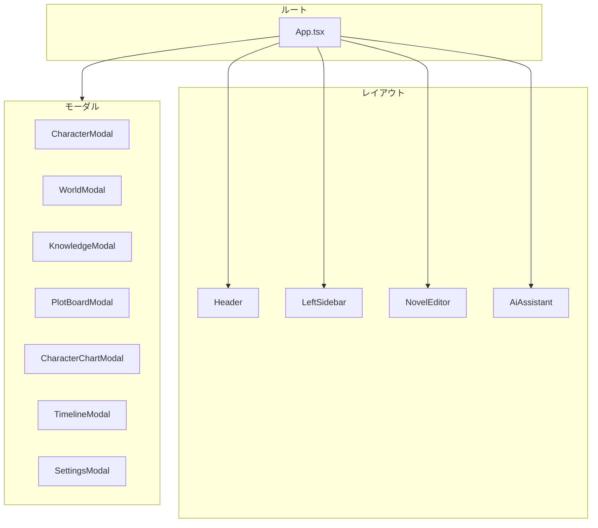
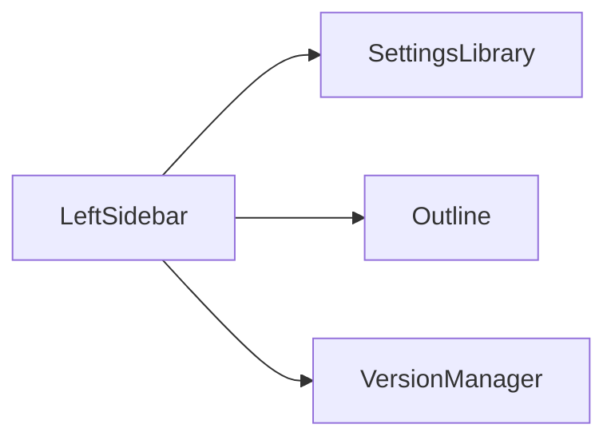
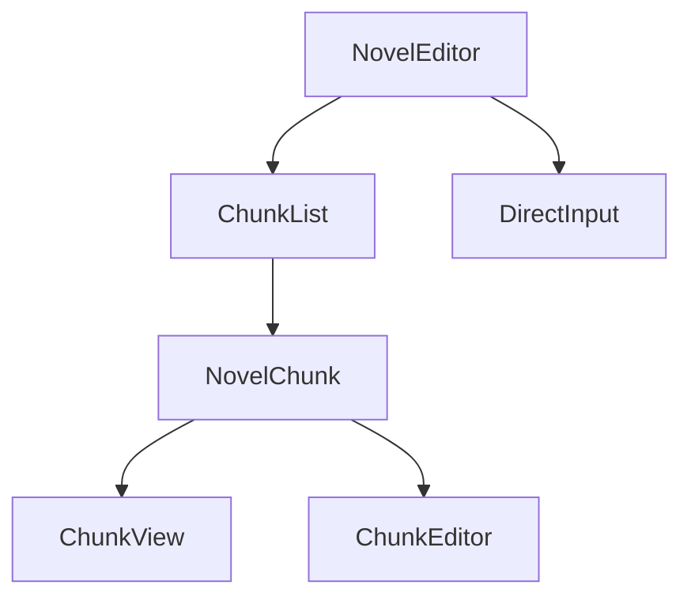
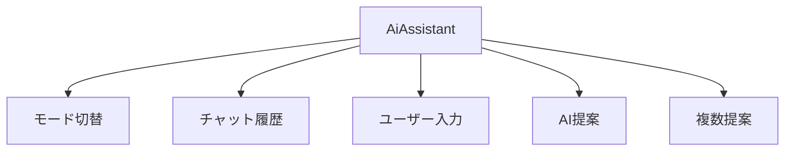

# コンポーネント

このページでは、小説らいたーの主要なReactコンポーネントを説明します。

## コンポーネント階層



## App.tsx

アプリケーションのエントリポイント。

### 責務

- 全体レイアウトの管理
- モーダルの表示制御
- プロジェクト選択画面との切り替え

### 構造

```tsx
const App: React.FC = () => {
    const { activeProjectId, activeModal } = useStore();

    if (!activeProjectId) {
        return <ProjectSelector />;
    }

    return (
        <div className="app-container">
            <Header />
            <main className="main-content">
                <LeftSidebar />
                <NovelEditor />
                <AiAssistant />
            </main>
            {activeModal && <ModalRenderer />}
        </div>
    );
};
```

## Header

ヘッダーバー。プロジェクト操作とナビゲーション。

### 機能

- プロジェクト一覧へ戻る
- エクスポート/インポート
- プレビュー
- 表示設定
- モード切替
- 検索

### Props

なし（Zustand経由で状態取得）

## LeftSidebar

左サイドバー。設定ライブラリ、アウトライン、バージョン管理。

### タブ構成



### SettingsLibrary

- キャラクター一覧
- 世界観一覧
- ナレッジ一覧
- プロット一覧
- 各種ツールボタン

### Outline

- 章の階層表示
- ドラッグ&ドロップ並べ替え
- 章へのジャンプ

### VersionManager

- スナップショット保存
- スナップショット復元

## NovelEditor

本文エディタ。小説本文の表示と編集。

### 構成



### ChunkList

段落（NovelChunk）のリストを表示。

```tsx
interface ChunkListProps {
    chunks: NovelChunk[];
    onEdit: (id: string) => void;
    onPin: (id: string) => void;
}
```

### ChunkEditor

段落の編集モード。

#### 機能

- テキスト編集
- 装飾適用（太字、下線、ルビ、色）
- 保存/キャンセル

### DirectInput

新規段落の直接入力エリア。

```tsx
interface DirectInputProps {
    onSubmit: (text: string) => void;
}
```

## AiAssistant

右サイドバー。AIとの対話インターフェース。

### 構成



### 主要な状態

```typescript
// 生成モード
generationMode: 'write' | 'consult'

// 複数提案
generateMultipleContinuations: boolean

// AI提案
aiSuggestions: {
    knowledge: string[];
    plot: PlotItem[];
}

// 複数展開
continuationChoices: Array<{
    id: string;
    title: string;
    text: string;
}> | null
```

## モーダルコンポーネント

### 共通パターン

```tsx
interface ModalProps {
    isOpen: boolean;
    onClose: () => void;
    payload?: any;  // 編集対象など
}
```

### CharacterModal

キャラクター設定の作成・編集。

#### タブ構成

1. プロフィール（基本情報）
2. 容姿（外見設定）
3. 性格・内面（性格、口調）
4. その他（メモなど）

#### AIアシスタント統合

```tsx
// AIアシスタントモード
const [isAssistantOpen, setIsAssistantOpen] = useState(false);
const [assistantMode, setAssistantMode] = useState<'consult' | 'apply'>('consult');
```

### WorldModal

世界観設定の作成・編集。

#### テンプレート機能

```typescript
const templates = {
    '場所': ['所属地域', '気候', '特産品'],
    '組織': ['リーダー', '目的', '規模'],
    '魔法': ['原理', '制限', '習得条件'],
    // ...
};
```

### KnowledgeModal

ナレッジの作成・編集。

#### 機能

- 名前、内容の編集
- カテゴリ選択
- タグ管理
- ピン留め

### CharacterChartModal

キャラクター相関図。

#### 技術

- SVGベースの描画
- ドラッグ&ドロップによる配置
- 関係線の追加・削除

```tsx
interface ChartNode {
    characterId: string;
    x: number;
    y: number;
}

interface ChartRelation {
    id: string;
    source: string;
    target: string;
    label: string;
    color: string;
}
```

### TimelineModal

タイムライン管理。

#### 構成

- レーン（列）管理
- イベントカード
- ドラッグ&ドロップ

```tsx
interface TimelineProps {
    events: TimelineEvent[];
    lanes: TimelineLane[];
    onEventMove: (eventId: string, newLaneId: string, newTimestamp: string) => void;
}
```

### PlotBoardModal

プロットボード。

#### 機能

- プロットカードの配置
- 関係線の追加
- タイムラインとの連携

## フローティングウィンドウ

サイドバーの内容を独立したウィンドウとして表示。

```tsx
interface FloatingWindow {
    id: string;
    type: LeftPanelTab;
    position: { x: number; y: number };
    size: { width: number; height: number };
    zIndex: number;
}
```

### 機能

- ドラッグで移動
- リサイズ
- フォーカス管理（z-index）

## カスタムフック

### useLocalStorage

LocalStorageとの同期。

```typescript
function useLocalStorage<T>(key: string, initialValue: T) {
    const [storedValue, setStoredValue] = useState<T>(() => {
        const item = window.localStorage.getItem(key);
        return item ? JSON.parse(item) : initialValue;
    });

    const setValue = (value: T | ((val: T) => T)) => {
        const valueToStore = value instanceof Function
            ? value(storedValue)
            : value;
        setStoredValue(valueToStore);
        window.localStorage.setItem(key, JSON.stringify(valueToStore));
    };

    return [storedValue, setValue] as const;
}
```

## パフォーマンス最適化

### React.memo の使用

```tsx
// 頻繁に再レンダリングされるコンポーネント
const ChunkView = React.memo<ChunkViewProps>(({ chunk, onEdit }) => {
    return (
        <div className="chunk-view">
            {/* ... */}
        </div>
    );
});
```

### useCallback / useMemo

```tsx
// イベントハンドラのメモ化
const handleEdit = useCallback((id: string) => {
    setEditingChunkId(id);
}, []);

// 派生データのメモ化
const sortedChunks = useMemo(() =>
    chunks.sort((a, b) => a.order - b.order),
    [chunks]
);
```

### 遅延ロード

```tsx
// モーダルの遅延ロード
const CharacterModal = React.lazy(() =>
    import('./modals/CharacterModal')
);

// 使用時
<Suspense fallback={<Loading />}>
    {activeModal === 'character' && <CharacterModal />}
</Suspense>
```

## スタイリング

### CSS構成

```
index.css
├── リセット・基本スタイル
├── レイアウト（グリッド、フレックス）
├── コンポーネント別スタイル
├── テーマ（ライト、ダーク、セピア）
└── レスポンシブ
```

### テーマ切り替え

```css
/* ライトテーマ（デフォルト） */
:root {
    --bg-primary: #ffffff;
    --text-primary: #1a1a1a;
}

/* ダークテーマ */
[data-theme="dark"] {
    --bg-primary: #1a1a1a;
    --text-primary: #ffffff;
}

/* セピアテーマ */
[data-theme="sepia"] {
    --bg-primary: #f4ecd8;
    --text-primary: #5c4b37;
}
```

## コンポーネント一覧

| コンポーネント | ファイル | 用途 |
|---------------|---------|------|
| App | App.tsx | ルート |
| Header | components/Header.tsx | ヘッダー |
| LeftSidebar | components/LeftSidebar/ | 左パネル |
| NovelEditor | components/NovelEditor/ | 本文エディタ |
| AiAssistant | components/AiAssistant/ | 右パネル |
| CharacterModal | components/modals/CharacterModal.tsx | キャラ設定 |
| WorldModal | components/modals/WorldModal.tsx | 世界観設定 |
| KnowledgeModal | components/modals/KnowledgeModal.tsx | ナレッジ |
| CharacterChartModal | components/modals/CharacterChartModal.tsx | 相関図 |
| TimelineModal | components/modals/TimelineModal.tsx | タイムライン |
| PlotBoardModal | components/modals/PlotBoardModal.tsx | プロットボード |
