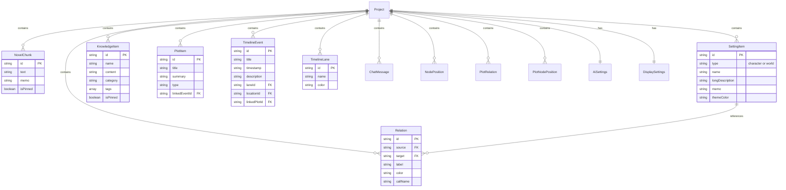
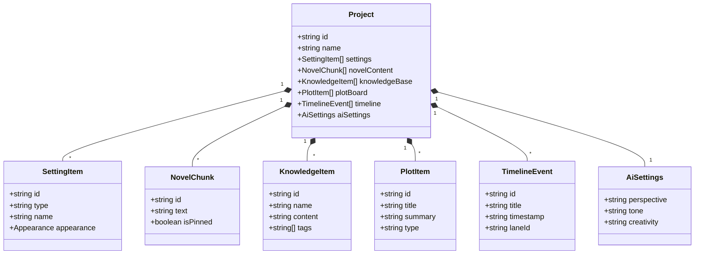

# データモデル

このページでは、小説らいたーで使用されるデータモデル（型定義）を説明します。

## ER図



## 主要な型定義

### Project

プロジェクト全体を表す最上位のエンティティです。

```typescript
interface Project {
    id: string;
    name: string;
    lastModified: string;
    isSimpleMode?: boolean;

    // コンテンツ
    settings: SettingItem[];
    novelContent: NovelChunk[];
    chatHistory: ChatMessage[];
    knowledgeBase: KnowledgeItem[];
    plotBoard: PlotItem[];
    timeline: TimelineEvent[];
    timelineLanes: TimelineLane[];

    // 関係性
    characterRelations: Relation[];
    nodePositions: NodePosition[];
    plotRelations: PlotRelation[];
    plotNodePositions: PlotNodePosition[];
    plotTypeColors: { [key: string]: string };

    // 設定
    userProfile?: {
        iconUrl: string;
        name?: string;
    };
    aiSettings: AiSettings;
    displaySettings: DisplaySettings;

    // 履歴
    historyTree?: HistoryTree;
}
```

### NovelChunk

小説本文の一段落を表します。

```typescript
interface NovelChunk {
    id: string;           // 一意識別子
    text: string;         // 本文テキスト（Markdown形式）
    memo?: string;        // 作者メモ
    isPinned?: boolean;   // ピン留め状態
}
```

### SettingItem

キャラクターまたは世界観の設定項目を表します。

```typescript
interface SettingItem {
    id: string;
    type: 'character' | 'world';
    name: string;
    longDescription?: string;
    memo?: string;
    exportDescription?: string;
    isAutoFilled?: boolean;

    // キャラクター専用
    furigana?: string;
    gender?: string;
    age?: string;
    species?: string;
    firstPersonPronoun?: string;
    personality?: string;
    origin?: string;
    affiliation?: string;
    speechPattern?: string;
    secret?: string;
    themeColor?: string;
    hairColor?: string;
    eyeColor?: string;
    appearance?: {
        imageUrl: string;
        traits: { key: string, value: string }[];
    };

    // 世界観専用
    fields?: { key: string, value: string }[];
    mapImageUrl?: string;
}
```

### KnowledgeItem

ナレッジベースの項目を表します。

```typescript
interface KnowledgeItem {
    id: string;
    name: string;           // ナレッジ名
    content: string;        // 詳細内容
    category?: string;      // カテゴリ
    tags?: string[];        // タグ配列
    isPinned?: boolean;     // ピン留め状態
    isAutoFilled?: boolean; // AI自動生成フラグ
}
```

### PlotItem

プロットボードの項目を表します。

```typescript
interface PlotItem {
    id: string;
    title: string;           // プロットタイトル
    summary: string;         // 要約・説明
    type: string;            // 種別（章、クライマックス等）
    linkedEventId?: string;  // 紐付くタイムラインイベント
    lastModified?: number;   // 最終更新時刻
}
```

### TimelineEvent

タイムラインのイベントを表します。

```typescript
interface TimelineEvent {
    id: string;
    title: string;              // イベントタイトル
    timestamp: string;          // 発生時期
    description: string;        // 詳細説明
    laneId: string;             // 所属レーンID
    locationId?: string;        // 発生場所（世界観ID）
    customLocationName?: string;// カスタム場所名
    lastModified?: number;      // 最終更新時刻
    linkedPlotId?: string;      // 紐付くプロットID
}
```

### TimelineLane

タイムラインのレーン（列）を表します。

```typescript
interface TimelineLane {
    id: string;
    name: string;    // レーン名
    color: string;   // 表示色
}
```

### Relation

キャラクター間の関係を表します。

```typescript
interface Relation {
    id: string;
    source: string;      // 関係元キャラクターID
    target: string;      // 関係先キャラクターID
    label: string;       // 関係性ラベル（親友、宿敵等）
    color: string;       // 線の色
    callName?: string;   // 呼び方
}
```

### ChatMessage

AIとのチャット履歴を表します。

```typescript
interface ChatMessage {
    role: 'user' | 'assistant';
    text: string;
    mode: 'write' | 'consult';
}
```

### AiSettings

AI関連の設定を表します。

```typescript
interface AiSettings {
    perspective: string;                    // 視点
    length: number;                         // 生成長さ
    tone: string;                           // トーン
    creativity: string;                     // 創作性
    knowledgeAdherence: string;             // 知識忠実度
    suggestionFrequency: string;            // 提案頻度
    memoryScope: string;                    // 記憶範囲
    assistantPersona: string;               // ペルソナ
    markdownFrequency: string;              // Markdown使用頻度
    showSpeakerInDialogue: boolean;         // セリフに話者名表示
    writingStyleMimicry: boolean;           // 文体模倣
    generateMultipleContinuations: boolean; // 複数提案
    applySpeakerColorToDialogue: boolean;   // セリフ色適用
}
```

### DisplaySettings

表示設定を表します。

```typescript
interface DisplaySettings {
    theme: 'light' | 'sepia' | 'dark';
    fontFamily: string;
    fontSize: number;
    swapSidebars?: boolean;
}
```

## 履歴管理

### HistoryTree

Undo/Redo用のツリー構造です。

```typescript
interface HistoryTree {
    nodes: Record<string, HistoryNode>;
    currentNodeId: string | null;
    rootId: string | null;
}

interface HistoryNode {
    id: string;
    parentId: string | null;
    childrenIds: string[];
    timestamp: number;
    type: HistoryType;
    label: string;
    payload: Project;
}

type HistoryType =
    | "editor"
    | "character"
    | "world"
    | "knowledge"
    | "plot"
    | "timeline"
    | "chart"
    | "ai"
    | "settings"
    | "outline";
```

## AppState

アプリケーション全体の状態を表します。

```typescript
interface AppState {
    // プロジェクト管理
    allProjectsData: { [key: string]: Project };
    activeProjectId: string | null;

    // UI状態
    userInput: string;
    isLoading: boolean;
    generationMode: 'write' | 'consult';
    highlightedChunkId: string | null;
    editingChunkId: string | null;
    saveStatus: 'synced' | 'saving' | 'dirty';

    // サイドバー
    leftPanelTab: LeftPanelTab;
    isLeftSidebarOpen: boolean;
    isRightSidebarOpen: boolean;
    leftSidebarWidth: number;
    rightSidebarWidth: number;

    // モーダル
    activeModal: ModalType | null;
    modalPayload: any;
    isModalDirty: boolean;

    // AI提案
    aiSuggestions: {
        knowledge: string[];
        plot: PlotItem[];
    };
    continuationChoices: { id: string; title: string; text: string }[] | null;

    // 履歴
    historyTree: HistoryTree;

    // チュートリアル
    isTutorialActive: boolean;
    tutorialStep: number;

    // ユーザー設定
    userMode: UserMode;
    undoScope: UndoScope;
}
```

## 型の関係図


