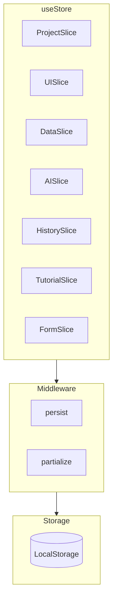
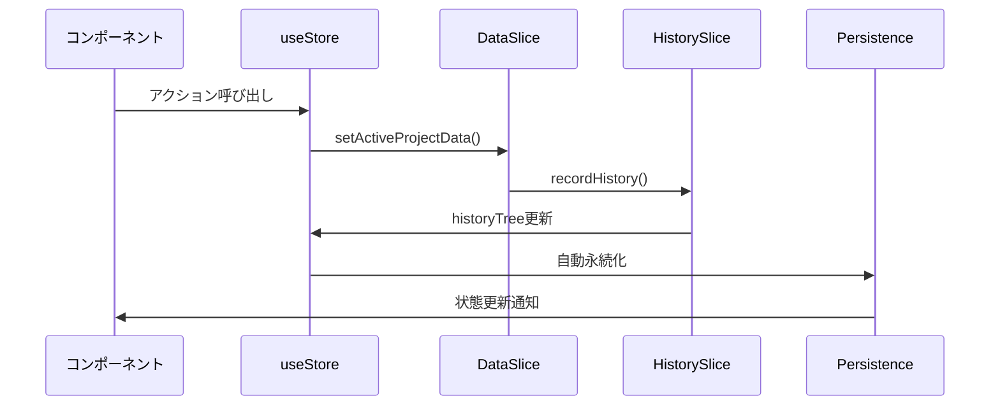
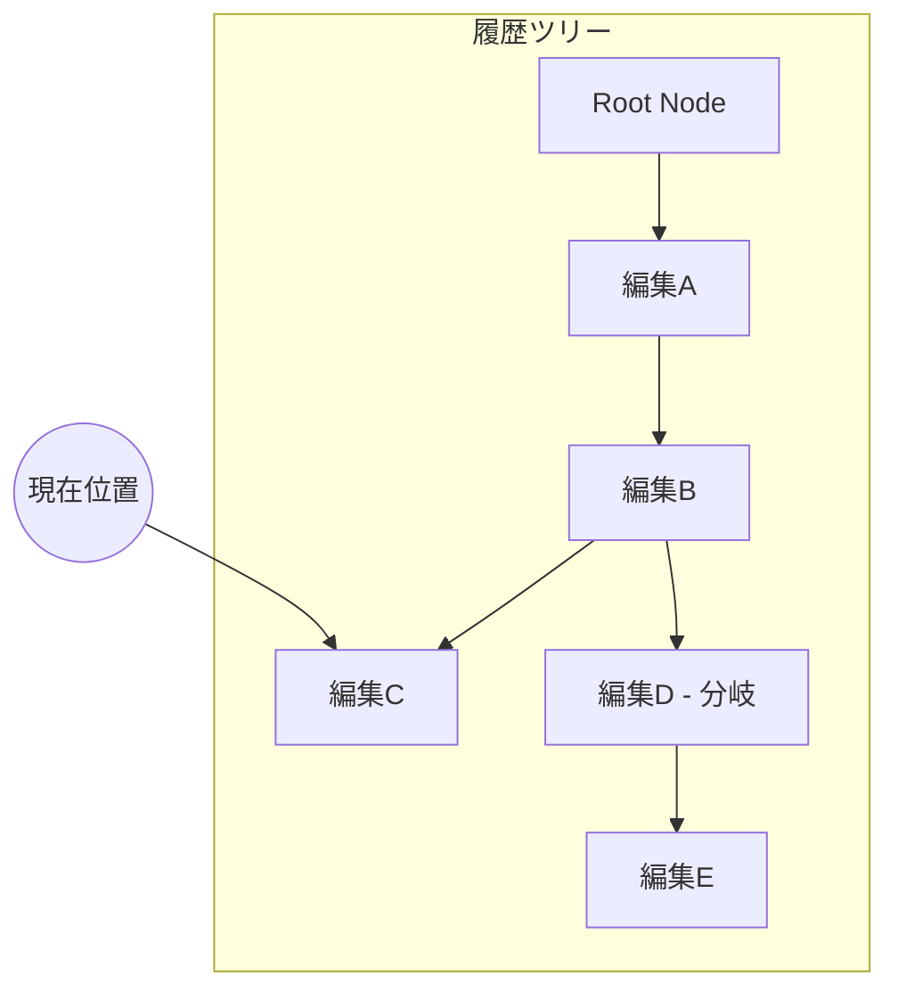

# 状態管理

このページでは、Zustandを使用した状態管理の仕組みを説明します。

## アーキテクチャ概要

小説らいたーでは、Zustandを使用してグローバル状態を管理しています。



## ストア構成

### store/index.ts

```typescript
import { create } from 'zustand';
import { persist, createJSONStorage } from 'zustand/middleware';

export const useStore = create<
    AppState & AppActions &
    ProjectSlice & UISlice & DataSlice &
    AISlice & HistorySlice & TutorialSlice & FormSlice
>()(
    persist(
        (set, get, api) => ({
            ...createProjectSlice(set, get),
            ...createUISlice(set, get),
            ...createDataSlice(set, get),
            ...createAISlice(set, get),
            ...createHistorySlice(set, get),
            ...createTutorialSlice(set, get),
            ...createFormSlice(set, get),
            loadInitialState: () => {},
        }),
        {
            name: 'NOVEL_WRITER_storage',
            storage: createJSONStorage(() => customStorage),
            partialize: (state) => ({
                // 永続化する項目のみ
                allProjectsData: state.allProjectsData,
                activeProjectId: state.activeProjectId,
                // UI設定
                isLeftSidebarOpen: state.isLeftSidebarOpen,
                isRightSidebarOpen: state.isRightSidebarOpen,
                // ...
            }),
        }
    )
);
```

## Slice パターン

各Sliceは特定の機能領域の状態とアクションを管理します。

### ProjectSlice

プロジェクト全体の管理を担当。

```typescript
interface ProjectSlice {
    // アクション
    createProject: (name: string, mode: 'simple' | 'standard') => void;
    deleteProject: (id: string) => void;
    setActiveProjectId: (id: string | null) => void;
    importProject: (event: React.ChangeEvent<HTMLInputElement>) => void;
    exportProject: () => void;
}
```

主な責務：
- プロジェクトの作成・削除
- アクティブプロジェクトの切り替え
- インポート・エクスポート

### UISlice

UI状態の管理を担当。

```typescript
interface UISlice {
    // 状態
    isLeftSidebarOpen: boolean;
    isRightSidebarOpen: boolean;
    leftSidebarWidth: number;
    rightSidebarWidth: number;
    leftPanelTab: LeftPanelTab;
    floatingWindows: FloatingWindow[];

    // アクション
    setIsLeftSidebarOpen: (isOpen: boolean) => void;
    setLeftPanelTab: (tab: LeftPanelTab) => void;
    addFloatingWindow: (type: LeftPanelTab) => void;
    removeFloatingWindow: (id: string) => void;
}
```

主な責務：
- サイドバーの開閉
- パネル幅の管理
- フローティングウィンドウの管理

### DataSlice

データ操作の管理を担当。

```typescript
interface DataSlice {
    // アクション
    setActiveProjectData: (
        updater: (data: Project) => Project,
        historyLabel?: { type: HistoryType; label: string },
        options?: { mode: 'merge' | 'replace' }
    ) => void;

    // キャラクター操作
    addCharacter: (character: SettingItem) => void;
    updateCharacter: (id: string, updates: Partial<SettingItem>) => void;
    deleteCharacter: (id: string) => void;

    // ナレッジ操作
    addKnowledge: (item: KnowledgeItem) => void;
    updateKnowledge: (id: string, updates: Partial<KnowledgeItem>) => void;
    deleteKnowledge: (id: string) => void;

    // プロット操作
    addPlot: (item: PlotItem) => void;
    updatePlot: (id: string, updates: Partial<PlotItem>) => void;
    deletePlot: (id: string) => void;
}
```

主な責務：
- プロジェクトデータの更新
- CRUD操作の提供
- 履歴記録の統合

### AISlice

AI関連の状態管理を担当。

```typescript
interface AISlice {
    // 状態
    isLoading: boolean;
    aiSuggestions: {
        knowledge: string[];
        plot: PlotItem[];
    };
    continuationChoices: Array<{
        id: string;
        title: string;
        text: string;
    }> | null;

    // アクション
    setIsLoading: (isLoading: boolean) => void;
    setContinuationChoices: (choices: ContinuationChoice[] | null) => void;
    acceptSuggestion: (type: 'knowledge' | 'plot', index: number) => void;
    rejectSuggestion: (type: 'knowledge' | 'plot', index: number) => void;
}
```

主な責務：
- ローディング状態
- AI提案の管理
- 複数提案の管理

### HistorySlice

履歴管理（Undo/Redo）を担当。

```typescript
interface HistorySlice {
    // 状態
    historyTree: HistoryTree;
    undoScope: UndoScope;

    // アクション
    recordHistory: (type: HistoryType, label: string) => void;
    undo: () => void;
    redo: () => void;
    setUndoScope: (scope: UndoScope) => void;
}
```

主な責務：
- 履歴ツリーの管理
- Undo/Redo操作
- スコープ別の履歴管理

## 状態更新フロー



## 永続化

### partialize による選択的永続化

```typescript
partialize: (state) => {
    // 各プロジェクト内の冗長なデータを削除
    const projects = { ...state.allProjectsData };
    Object.keys(projects).forEach(id => {
        if (projects[id]) {
            const { historyTree, ...rest } = projects[id];
            projects[id] = rest;
        }
    });

    return {
        allProjectsData: projects,
        activeProjectId: state.activeProjectId,
        isLeftSidebarOpen: state.isLeftSidebarOpen,
        isRightSidebarOpen: state.isRightSidebarOpen,
        leftSidebarWidth: state.leftSidebarWidth,
        rightSidebarWidth: state.rightSidebarWidth,
        userMode: state.userMode,
        undoScope: state.undoScope,
        historyTree: state.historyTree,
        pinnedSettingIds: state.pinnedSettingIds,
    };
}
```

### 容量制限対応

```typescript
const customStorage = {
    getItem: (name: string) => localStorage.getItem(name),
    setItem: (name: string, value: string) => {
        try {
            localStorage.setItem(name, value);
        } catch (e) {
            if (e instanceof DOMException &&
                (e.name === 'QuotaExceededError' ||
                 e.name === 'NS_ERROR_DOM_QUOTA_REACHED')) {
                console.error('LocalStorage quota exceeded');
                alert('ブラウザの保存容量がいっぱいです...');
            } else {
                throw e;
            }
        }
    },
    removeItem: (name: string) => localStorage.removeItem(name),
};
```

## 履歴管理の仕組み

### ツリー構造



### Undo/Redo の動作

```typescript
// Undo: 親ノードに移動
undo: () => {
    const { historyTree, undoScope } = get();
    const currentNode = historyTree.nodes[historyTree.currentNodeId];

    if (!currentNode?.parentId) return;

    // スコープに応じてフィルタリング
    const targetNode = findValidParent(currentNode, undoScope);
    if (targetNode) {
        set({
            historyTree: {
                ...historyTree,
                currentNodeId: targetNode.id
            }
        });
        restoreFromNode(targetNode);
    }
};

// Redo: 最後に訪問した子ノードに移動
redo: () => {
    const { historyTree, undoScope } = get();
    const currentNode = historyTree.nodes[historyTree.currentNodeId];

    if (!currentNode?.childrenIds.length) return;

    // 最後の子ノードを選択
    const lastChildId = currentNode.childrenIds[currentNode.childrenIds.length - 1];
    const targetNode = historyTree.nodes[lastChildId];

    if (targetNode) {
        set({
            historyTree: {
                ...historyTree,
                currentNodeId: targetNode.id
            }
        });
        restoreFromNode(targetNode);
    }
};
```

## コンポーネントでの使用

### 状態の取得

```typescript
// 個別の状態を取得（セレクタ使用推奨）
const isLoading = useStore((state) => state.isLoading);
const activeProject = useStore((state) =>
    state.activeProjectId
        ? state.allProjectsData[state.activeProjectId]
        : null
);

// 複数の状態をまとめて取得
const { userInput, setUserInput, isLoading } = useStore((state) => ({
    userInput: state.userInput,
    setUserInput: state.setUserInput,
    isLoading: state.isLoading,
}));
```

### アクションの呼び出し

```typescript
// 直接呼び出し
const setUserInput = useStore((state) => state.setUserInput);
setUserInput('新しい入力');

// データ更新（履歴付き）
const setActiveProjectData = useStore((state) => state.setActiveProjectData);
setActiveProjectData(
    (project) => ({
        ...project,
        novelContent: [...project.novelContent, newChunk]
    }),
    { type: 'editor', label: '本文追加' }
);
```

## ベストプラクティス

### 1. セレクタの使用

```typescript
// 良い例：必要な状態のみ購読
const isLoading = useStore((state) => state.isLoading);

// 悪い例：ストア全体を購読
const store = useStore();
```

### 2. アクションの分離

```typescript
// 良い例：アクションを一度だけ取得
const addCharacter = useStore((state) => state.addCharacter);
// コールバック内で使用
const handleAdd = () => addCharacter(newCharacter);

// 悪い例：毎回取得
const handleAdd = () => {
    useStore.getState().addCharacter(newCharacter);
};
```

### 3. 履歴記録の適切な使用

```typescript
// 変更をまとめて1つの履歴として記録
setActiveProjectData(
    (project) => {
        // 複数の変更を1つの関数内で
        return {
            ...project,
            settings: updatedSettings,
            characterRelations: updatedRelations,
        };
    },
    { type: 'character', label: 'キャラクター編集' }
);
```
